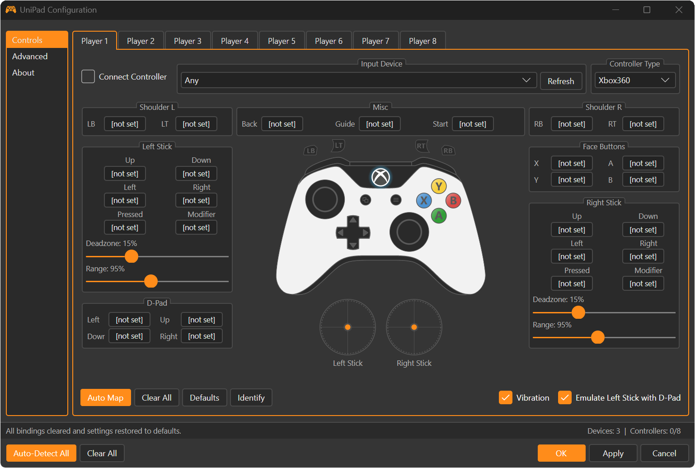
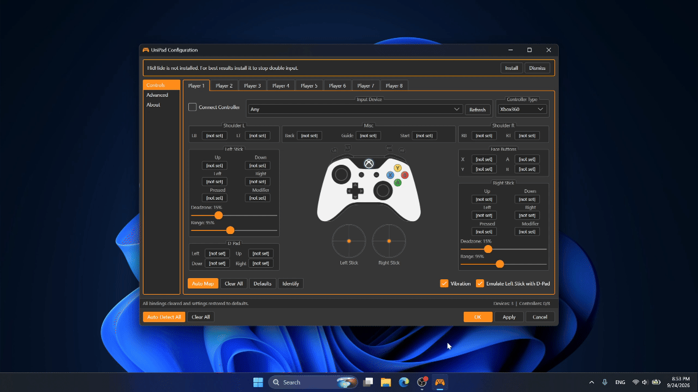
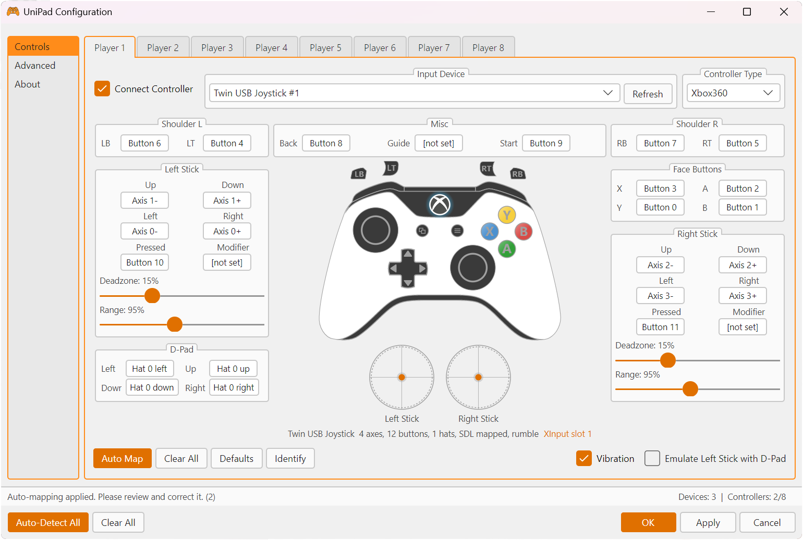
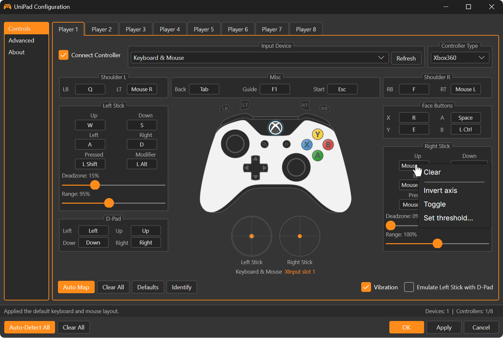
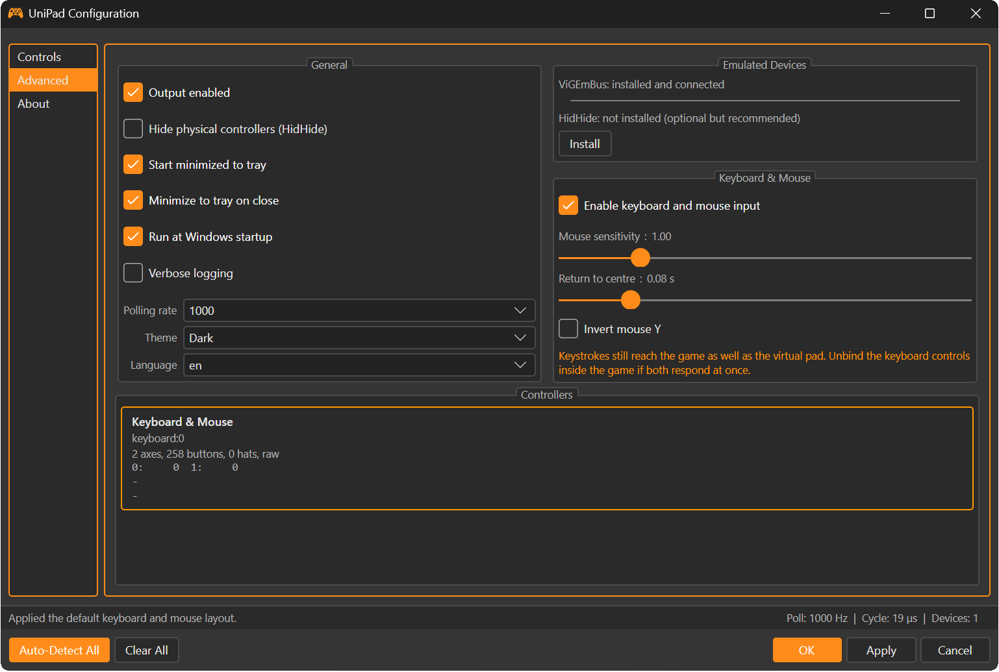

<div align="center">

# UniPad

**Universal Controller Mapper for Windows**

Make *any* controller work with *any* game.

[](LICENSE)
[](https://dotnet.microsoft.com/)
[](#)
[](../../releases/latest)




</div>

---

UniPad presents **any** input device — modern gamepads, analogue-less retro pads, arcade sticks,
racing wheels, PS1/PS2/N64/SNES USB adapters, no-name clones — to Windows as a standard
**Xbox 360 (XInput)** or **DualShock 4** controller.

If a game only speaks XInput, UniPad makes your hardware speak XInput.

## Contents

- [Quick start](#quick-start-for-regular-users)
- [Do I need to install anything else?](#do-i-need-to-install-anything-else)
- [Features](#features)
- [Usage guide](#usage-guide)
- [Building from source](#building-from-source)
- [Architecture](#architecture)
- [Troubleshooting](#troubleshooting)
- [Contributing](#contributing)
- [License and credits](#license)

## Quick start (for regular users)

> **You do not need Visual Studio, the .NET SDK, or any programming tools.**

1. Go to **[Releases](../../releases/latest)** and download **`UniPad.exe`**.
2. Double-click it. That is the whole installation — it is a single portable file.
3. On first run a banner may say *ViGEmBus is not installed*. Click **Install** and approve the
   Windows prompt. UniPad downloads and installs it for you.
4. Open a **Player** tab → tick **Connect Controller** → pick your device → click **Auto Map**.
5. Click **Apply**. Verify at [gamepad-tester.com](https://gamepad-tester.com) or by running `joy.cpl`.

<div align="center">
  
  <br>
  <em>One click on <strong>Auto Map</strong> and an unknown pad is fully bound.</em>
</div>

### Do I need to install anything else?

| Component | Needed? | Notes |
|---|---|---|
| .NET runtime | ❌ **No** | The release build is self-contained — the runtime is inside the exe. |
| Visual Studio / SDK | ❌ **No** | Only needed if you want to build from source. |
| **ViGEmBus driver** | ✅ **Yes, once** | Installed automatically by UniPad on first run (one UAC prompt). |
| HidHide | ⚪ Optional | Only to stop "double input". UniPad can install it for you too. |

> **Why can't ViGEmBus be inside the exe?**
> Creating a virtual controller requires a **kernel-mode driver**, and Windows does not allow a
> portable application to fabricate one. Every tool of this kind (DS4Windows, x360ce, reWASD) has
> the same requirement. UniPad at least makes it a single click instead of a scavenger hunt.

## Features

**Input**
- Detects *everything* SDL3 can see: gamepads, joysticks, wheels, arcade sticks, generic HID pads
- Hot-plug: connect or disconnect mid-session, mappings survive and re-attach automatically
- Stable device identity, so a controller returning on a different USB port keeps its bindings
- Handles drifting/noisy analogue axes from cheap adapters via resting-value calibration
- Raw device monitor showing live axis/button/hat values — invaluable for unknown hardware

**Mapping**
- **Auto-map** with two paths: the SDL gamepad database, and a heuristic fallback for unknown pads
- **Full manual mapping** — click a bind, press the input, done. Never touch a config file.
- All four conversion scenarios:
  - button → button
  - **button → axis** at full deflection *(this is what makes analogue-less retro pads work)*
  - axis → button (threshold)
  - axis → axis
- **Radial** dead zone (not per-axis), adjustable range, invert, threshold, modifier and toggle
- **Emulate Left Stick with D-Pad** for controllers that have no analogue sticks at all

**Output**
- Virtual **Xbox 360** and **DualShock 4** controllers via ViGEmBus
- **Up to 8 players** for local multiplayer
- Rumble return path from game → virtual pad → your physical controller
- **Identify** button to find out which physical pad is which
- Optional **HidHide** integration to hide physical devices and stop double input

**Application**
- Single portable `.exe` — no installer, no registry mess, nothing left behind
- Portable data folder next to the executable (falls back to `%APPDATA%` on read-only media)
- Profiles with save/load and schema migration
- System tray, minimize-to-tray, run-at-startup
- Dark and light themes
- **English and Persian (فارسی)** with full right-to-left layout
- 1000 Hz polling with a zero-allocation hot path

<div align="center">
   
</div>

## Usage guide

### The controls at a glance

Everything for one player lives on a single tab, so nothing is hidden behind wizards or dialogs.
The window title bar, the live controller preview in the middle and the stick visualisers at the
bottom all update in real time while you press buttons, which means you can confirm a mapping
without ever launching a game.

| Control | What it does |
|---|---|
| **Auto Map** | Binds the selected device automatically — SDL database first, heuristics as fallback. |
| **Clear All** | Removes every binding for this player only. |
| **Defaults** | Restores dead zone, range and option defaults without touching bindings. |
| **Identify** | Rumbles the selected physical pad so you know which one it is. |
| **Auto-Detect All** | Runs Auto Map for every connected player tab at once. |
| **Vibration** | Enables the rumble return path from the game to your physical pad. |
| **Emulate Left Stick with D-Pad** | Drives the left stick from the D-Pad, for pads with no sticks. |
| **Apply** | Creates/updates the virtual controllers. Nothing reaches games until you press this. |

The status bar tells you where a mapping came from (for example *Mapped from the SDL controller
database*) plus how many devices are visible and how many of the 8 player slots are in use.

### Mapping an unknown controller

1. **Player** tab → tick **Connect Controller**.
2. Choose your device in **Input Device**. If it is not listed, click **Refresh**.
3. Click **Auto Map** and test. For a known pad this is usually all you need.
4. For anything wrong: click the bind button, then press the physical input within 5 seconds.

### Fixing a single binding — right-click

You never have to redo a whole mapping because one button landed in the wrong place.
**Right-click any bind button** for its own menu:

<div align="center">
  
</div>

| Menu item | Use it when |
|---|---|
| **Clear** | You want to unbind just this one input and leave everything else alone. |
| **Invert axis** | A stick, pedal or trigger reads backwards. Common on racing wheels and cheap adapters. |
| **Toggle** | You want the input to latch on/off instead of being held — handy for sprint or handbrake. |
| **Set threshold…** | An axis is being used as a button and you need to choose how far it must travel to count as a press. |

### Controllers with no analogue sticks

Retro pads (NES/SNES/Mega Drive adapters) have only a D-Pad, so games expecting a stick ignore them.

Tick **Emulate Left Stick with D-Pad**. The D-Pad then drives the left stick at full deflection,
with diagonals normalised to 0.7071 so diagonal movement isn't faster than straight movement.

### Local multiplayer

Add players on tabs 1–8. Set each one's **Input Device** and **Output Mode**.

> ⚠️ **Windows provides only 4 XInput slots.** Players 5–8 must use DualShock 4 output, which
> XInput-only games will not see. UniPad states this on those tabs. This is a Windows limitation,
> not a UniPad one.

### Stopping "double input"

Windows sees both your physical controller *and* the virtual one, so some games register every
input twice. Fix: install **HidHide** (Advanced tab → Install) and tick
**Hide physical controllers**.

### When a pad reports nonsense

Unknown and clone hardware sometimes reports button indices that have nothing to do with the
labels printed on the plastic. The **Advanced** tab has a raw monitor that shows every axis,
button and hat live, so you can press a button, read its real index, and bind it by hand.

<div align="center">
  
</div>

## Building from source

Requires the **[.NET 9 SDK](https://dotnet.microsoft.com/download/dotnet/9.0)** on Windows.

```cmd
git clone https://github.com/UniPad-app/UniPad.git
cd UniPad
dotnet build UniPad.sln -c Release
```

To produce the portable single-file executable:

```cmd
build\publish.cmd
```

Output: `build\out\UniPad.exe` (~48 MB, self-contained, compressed).

Cross-compiling the Windows binary from Linux or macOS also works:

```bash
dotnet publish src/UniPad.App/UniPad.App.csproj \
  -c Release -r win-x64 --self-contained true \
  -p:PublishSingleFile=true -p:EnableCompressionInSingleFile=true \
  -p:DebugType=none -o build/out
```

## Architecture

```
UniPad/
├── UniPad.sln
├── Directory.Build.props          net9.0, C# 13, nullable, unsafe blocks
├── build/publish.cmd              single-file release script
└── src/
    ├── UniPad.Core/               all logic, zero UI dependencies
    │   ├── Input/                 SdlInputBackend, DeviceId, InputSnapshot, InputDevice
    │   ├── Mapping/               MappingEngine, AutoMapper, InputBinding, PadState
    │   ├── Output/                ViGEmX360Pad, ViGEmDs4Pad, OutputManager, FeedbackRouter
    │   ├── Profiles/              ProfileStore + JSON source-generated context
    │   └── System/                PortablePaths, DriverBootstrapper, HidHideService, LogSetup
    └── UniPad.App/                Avalonia 11 UI
        ├── Views/                 MainWindow, PlayerConfigView, AdvancedView, AboutView
        ├── Views/Controls/        ControllerPreview, AnalogStickPreview, TriggerBar, BindButton
        ├── ViewModels/            MainWindow, PlayerConfig, Advanced, About, BindButton
        ├── Services/              AppState, BindCaptureService, TrayIconHost, StartupRegistration
        ├── Styles/                Palette.axaml, Controls.axaml
        └── Localization/          Strings.cs — 99 keys × English/Persian, RTL aware
```

### Design decisions

| Area | Decision |
|---|---|
| Input | SDL3 (`ppy.SDL3-CS`) — joystick + gamepad + events, background-events hint enabled |
| Poll loop | Dedicated thread at 1000 Hz, hybrid `Thread.Sleep(1)` + `SpinWait` precise wait |
| Hot path | Zero allocation: pre-allocated arrays, mutable `PadState` passed `in`/`ref`, no LINQ |
| Dead zone | **Radial**: `mag = √(x²+y²)`, then `min((mag−dz)/(1−dz), 1) × range` |
| Axis drift | Resting values captured at open; bind capture needs >50 % travel from a fresh baseline |
| Feedback loop | `ExpectVirtualDevice()` blacklists joysticks appearing within 500 ms of a ViGEm connect |
| XInput order | Pads connected with a 300 ms stagger so Windows assigns slots in player order |
| UI refresh | 60 Hz dispatcher timer, decoupled from input; diagnostics throttled to ~6 Hz |
| Persistence | `System.Text.Json` **source generator** (trim-safe), portable data folder |

## Troubleshooting

| Problem | Cause / fix |
|---|---|
| *"ViGEmBus is not installed"* won't go away | Restart after installing the driver. If it persists, install [ViGEmBus](https://github.com/nefarius/ViGEmBus/releases) manually. |
| Game registers every input twice | Install HidHide and tick **Hide physical controllers**. |
| Controller not listed | Click **Refresh**. If still missing, check it appears in `joy.cpl`. |
| Game ignores players 5–8 | Windows has only 4 XInput slots; those players emit DS4. Not fixable. |
| Stick drifts on its own | Raise the dead zone on that stick. Cheap adapters often need 0.15–0.25. |
| Buttons map to the wrong thing | Use the Advanced tab's raw monitor to see real indices, then bind manually. |
| Nothing happens in-game | Check **Output enabled** on the Advanced tab, and that the profile was **Applied**. |
| Game with anti-cheat rejects it | Kernel-mode anti-cheat may block virtual pads. UniPad does not attempt to bypass it. |

Logs live in the `logs` folder next to `UniPad.exe` (or under `%APPDATA%\UniPad\logs` when the
executable sits on read-only media). Attach the newest log file to any bug report.

### Anti-cheat and privacy

UniPad creates a virtual gamepad through the public ViGEmBus driver and does nothing else to your
system. It does not inject into games, hook processes, or hide itself. Some competitive titles with
kernel-mode anti-cheat block virtual input devices on principle, and that is their decision to
make — UniPad will not try to work around it. Nothing is sent anywhere: there is no telemetry, no
account, and no network access apart from downloading the ViGEmBus/HidHide installers when you
explicitly ask it to.

## Contributing

Issues and pull requests are welcome.

**Reporting a bug.** The single most useful thing you can include is the exact controller name as
shown in the **Input Device** dropdown, plus the newest log file. A screenshot of the Advanced
tab's raw monitor while the problem is happening usually settles the question immediately.

**Adding controller support.** If Auto Map gets a pad wrong, the fix often belongs upstream in
[SDL_GameControllerDB](https://github.com/mdqinc/SDL_GameControllerDB) rather than in UniPad. Open
an issue either way and we can work out which.

**Code.** Keep `UniPad.Core` free of UI dependencies, and keep the polling hot path
allocation-free. New UI strings must be added to both English and Persian in `Strings.cs`.

## License

MIT — see [LICENSE](LICENSE).

### Third-party components

| Project | License |
|---|---|
| [SDL3](https://libsdl.org/) | zlib |
| [ViGEmBus / ViGEm.NET](https://github.com/nefarius/ViGEmBus) — Nefarius Software Solutions | MIT / BSD-3 |
| [HidHide](https://github.com/nefarius/HidHide) — Nefarius Software Solutions | MIT |
| [Avalonia UI](https://avaloniaui.net/) | MIT |
| [Serilog](https://serilog.net/) | Apache-2.0 |
| [CommunityToolkit.Mvvm](https://github.com/CommunityToolkit/dotnet) | MIT |
| [SDL_GameControllerDB](https://github.com/mdqinc/SDL_GameControllerDB) | Zlib |
